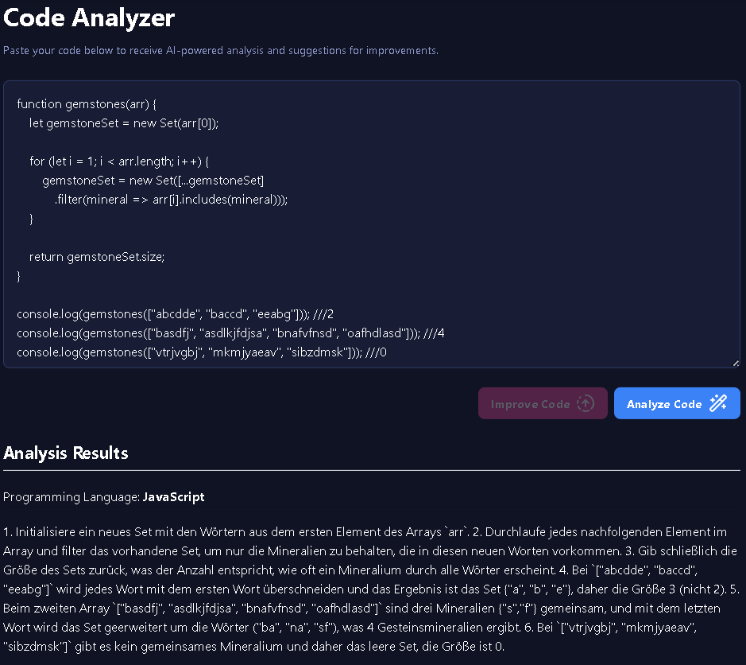

# explain-my-code-app
A simple web app that allows users to enter code for AI analysis. The web app consists of a **frontend, backend, and an AI engine**. This project only works properly on a local device with Ollama installed. The purpose of this project is educational. In this project, I learned **prompt engineering, AI integration** and **proper communication between frontend and backend**.

---

## Features
- AI-powered code analysis
- Bug detection and code quality suggestions
- Modern React frontend with TypeScript
- Java Spring Boot backend
- Integration with Ollama AI models

---

## Technologies Used
- React, Vite, TypeScript, Tailwind CSS
- Java, Spring Boot, Maven
- Ollama AI engine

---

## Frontend
The frontend is built with **Vite + React in TypeScript** and hosted on GitHub Pages. The React project supports multiple pages using *react-router-dom*. The pages are rendered inside a main layout, which is wrapped by an app frame layout.

### Installation & Usage
To run this project locally, first clone this repository. Then, navigate to */DirWithPulledProject/explain-my-code-app-frontend* and install all dependencies:
```bash
npm install
```

Then run:
```bash
npm run dev
```
(Open your browser at http://localhost:5173/explain-my-code-app/)

---

## Backend
The backend for this project is built with the **Spring Framework in Java** and is not currently hosted anywhere. The Spring application communicates with the Ollama service by making simple API requests to Ollama and returning the results to the client (frontend).

### Installation & Usage
To run the backend locally, first clone this repository. Then, navigate to */DirWithPulledProject/explain-my-code-app-backend* and build the backend with **Maven**:
```bash
mvn clean install
```

Start the backend server:
```bash
mvn spring-boot:run
```
(The backend service now runs at http://localhost:8080/)

---

## Ollama Service
The AI used for this project is **Ollama**. Ollama provides multiple models for different purposes; in this project, **phi3** and **codellama** can be used. Without Ollama, it is not possible to generate AI responses, and you will see a warning on the explain page.

### Installation & Usage
To install Ollama locally, download it for Windows from: https://ollama.com/download/windows. After installation, search for Ollama on your computer and run the application. Next, pull the required models for this project by opening your terminal and running:

For codellama (not used in the project):
```bash
ollama pull codellama
```

For phi3 (used model):
```bash
ollama pull phi3
```
To check if Ollama is running, open your terminal and type:
```bash
curl http://localhost:11434/api/tags
```
If you get an error, then it was not installed correctly.

(The Ollama server runs at http://localhost:11434)

---

## Showcase
Local explain-my-code setup with running backend and Ollama server!
[](link_url)

A live demo of the project (no AI features) can be found at: https://nikollbibajnoah.github.io/explain-my-code-app/